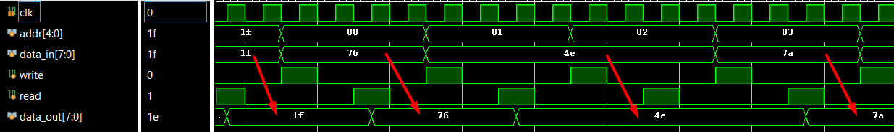

# Memory
Memory Interface

Block Diagram
    
    TOP top.sv
    |-----------------------------------------------------------------------------------------|
    |                                                                                         | 
    |           |-------------------|   |----------------|   |-------------------|            |
    |           |        TEST       |   |   Interface    |   |       MEMORY      |            |  
    |           |    mem_test.sv    |   |-----read------>|   |       mem.sv      |            |
    |           |                   |   |----write------>|   |                   |            |
    |           |                   |   |                |   |                   |            |
    |           |                   |===|---addr---/5--->|===|                   |            |
    |           |                   |   |                |   |                   |            |
    |           |                   |   |-data_in--/8--->|   |                   |            |
    |           |                   |   |                |   |                   |            |
    |           |                   |   |<--data_out--/8-|   |                   |            |
    |           |-------------------|   |----------------|   |-------------------|            |
    |                                            |                                            |
    |                                           clk                                           |
    |                                                                                         |
    |-----------------------------------------------------------------------------------------|

Specification
- `addr` is a 5-bit `logic` vector. `data_in` and `data_out` are both 8-bit `logic` vecots. `read`, `write`, and `clk` are `logic`.
- Memory write: `data_in` is written to `memory[addr]` on the positive edge of `clk` when `write = 1`.

Memory Write Cycle

- Memory read: `data_out`is assigned from `memory[addr]` on the positive edge of `clk` when `read = 1`.

Memory Read Cycle

Randomized Data Write and Read

- `read` and `write` should never be simultaneously high.
